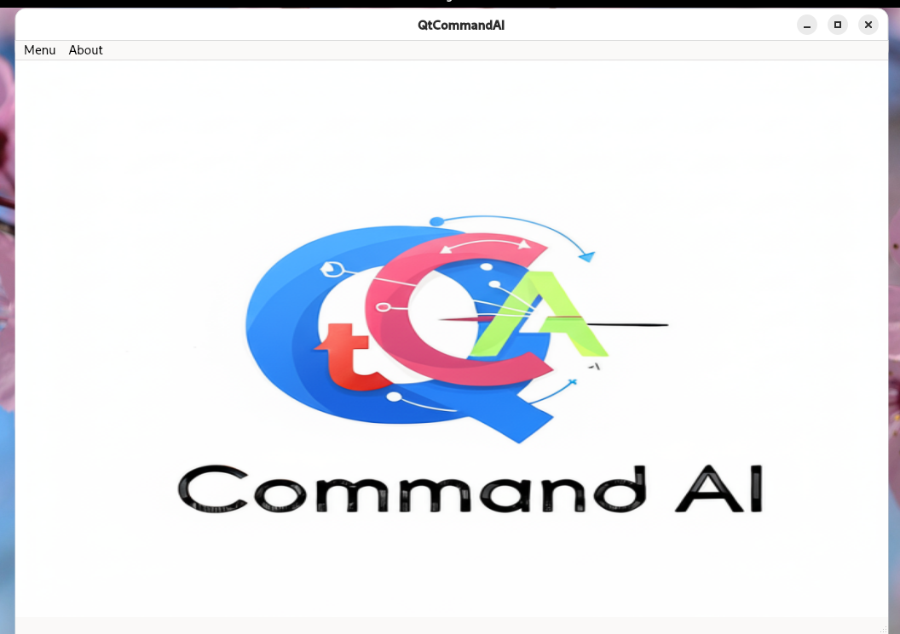

# QtCommandAI
QtCommandAI is an application designed to manage tasks, execute commands, conduct web research, and generate PDF files. For entertainment purposes, it can play videos on platforms like YouTube. Additionally, it has the capability to execute commands via a web serial port, enabling intelligent equipment to control tasks within large organizations.

First Screenshot:

